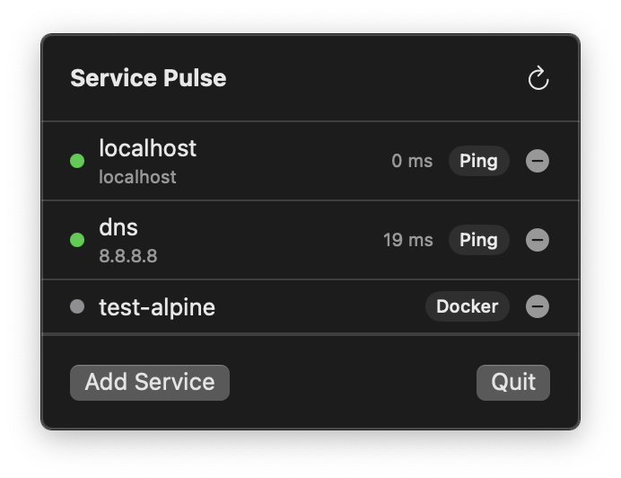

# Service Pulse

A lightweight macOS menubar app that monitors your services and shows their health at a glance.


[](LICENSE)

<p align="center">
  
</p>

## What it does

Service Pulse sits in your menu bar and keeps an eye on the things you care about:

- **Ping checks** — ICMP ping to any host or IP, with live latency
- **Docker checks** — reads your local Docker socket and reports container health
- **Background polling** every 30 seconds, plus a manual refresh button
- **Native notifications** when something goes down or comes back up
- **Local-only** — no servers, no telemetry, no accounts. Everything runs and stays on your Mac

The menubar icon reflects overall status:

| Icon | Meaning |
| --- | --- |
| 🟢 | All services healthy |
| 🟡 | Some services down |
| 🔴 | All services down |
| ⚪ | No data yet |

## Requirements

- macOS 15.5 or later
- [Docker Desktop](https://www.docker.com/products/docker-desktop/) (only if you want to monitor containers)

## Installation

1. Download the latest DMG from the [Releases](../../releases) page
2. Open the DMG and drag **Service Pulse** into your Applications folder
3. Service Pulse isn't notarized yet, so macOS will block it on first launch with a
   "cannot be opened" message. To allow it, open Terminal and run:
   ```bash
   xattr -cr "/Applications/Service Pulse.app"
   ```
   Then open the app again from Applications. (Alternatively, go to **System Settings →
   Privacy & Security** and click **Open Anyway** next to the warning.)

The app will launch and appear in your menu bar — no Dock icon, since it's a menubar-only app.

### Building from source

If you'd rather not run the `xattr` command, or want to make changes, you can build it
yourself with Xcode (16+):

```bash
git clone https://github.com/kobibell/service-pulse.git
cd service-pulse
open "Service Pulse.xcodeproj"
```

Then build and run (⌘R). Locally-built apps aren't quarantined, so this skips the Gatekeeper
warning entirely.

## Usage

1. Click the menubar icon to open the dropdown
2. Click **Add Service** to monitor a new ping target or Docker host
3. Statuses refresh automatically every 30 seconds, or click the refresh icon
4. Right-click or use the minus button on a row to remove a service

## Why no sandbox?

Service Pulse needs to run `/sbin/ping` and talk to `/var/run/docker.sock` directly, both of which
are restricted under the App Sandbox. It's distributed outside the App Store as a result.

## Releases

See the [Releases](../../releases) page for download links and patch notes for each version.
The app also checks for updates on launch and will show a link in the menu when a newer
version is available.

For planned features, see the [Roadmap](ROADMAP.md).

## Support this project

Service Pulse is free and open source. If you find it useful, consider supporting development:

- ☕ [Buy Me a Coffee](https://buymeacoffee.com/kobibell)
- 💖 [GitHub Sponsors](https://github.com/sponsors/kobibell)

## Contributing

Contributions are welcome! Please see [CONTRIBUTING.md](CONTRIBUTING.md) for guidelines.

## License

Source code is licensed under the [MIT License](LICENSE). The "Service Pulse" name and logo are
trademarks and may not be reused in forks or derivative distributions — see the LICENSE file for
details.
